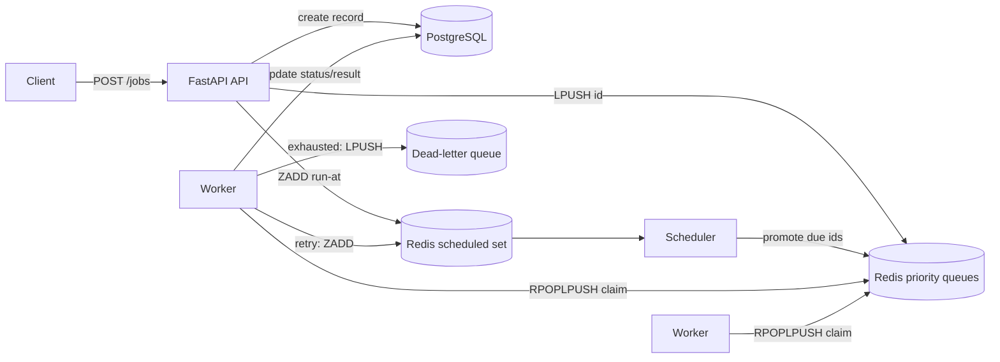

# Distributed Task Queue & Scheduler

A small but production-shaped job queue built from Redis primitives and PostgreSQL,
with a FastAPI control surface. Jobs are submitted over HTTP, dispatched through
priority queues, executed by a pool of workers, retried with exponential backoff,
and parked in a dead-letter queue when they give up. A scheduler handles delayed
and retried work.

Built to demonstrate the parts of backend engineering that interviews actually
probe: queue mechanics, reliability under failure, retries/idempotency, and
horizontal scaling.

## Features
- **Priority queues** (`high` / `default` / `low`) backed by raw Redis lists.
- **Reliable claim**: a job id is moved atomically into a per-worker processing
  list, so nothing is lost if a worker dies mid-run; it is requeued on restart.
- **Retries with exponential backoff** and a **dead-letter queue** after the
  attempt limit.
- **Delayed / scheduled jobs** via a Redis sorted set the scheduler drains.
- **Durable job state** in PostgreSQL (status, attempts, result, error).
- **FastAPI API**: submit, inspect, list, retry, and view queue stats.
- **Horizontal scaling**: run more workers; they share the same queues.
- **Tested** (17 unit/integration tests) and **linted** (ruff), with CI.

## Architecture 



PostgreSQL is the source of truth for each job; Redis holds only lightweight
pointers (job ids) for fast dispatch.

## How it works
- **Enqueue**: the API writes a `Job` row, then `LPUSH`es its id onto the chosen
  priority list (or `ZADD`s it to the scheduled set if a delay is given).
- **Claim**: a worker does `RPOPLPUSH` from each priority list, in order, into its
  own processing list. Because that move is atomic, a crash can't drop a job.
- **Execute**: the worker looks up the handler in the task registry, runs it,
  and records `succeeded` + result, or on error either re-schedules a retry
  (`ZADD` with a backoff delay) or moves the id to the dead-letter list.
- **Schedule**: the scheduler polls the sorted set and promotes any id whose
  run-at time has passed back into its priority queue.
- **Recovery**: on startup a worker requeues anything left in its processing list
  and any DB job still marked `running`.

Delivery is **at-least-once**: a crash between finishing work and acknowledging
can cause a re-run, so handlers should be idempotent. (A good thing to discuss in
an interview, and a natural next step to tighten.)

## Run it
```bash
docker compose up --build -d          # api + 2 workers + scheduler + redis + postgres
make seed                             # enqueue a few demo jobs
curl localhost:8000/stats             # queue depths + status counts
docker compose logs -f worker         # watch jobs run
```
API docs: http://localhost:8000/docs

Scale workers: raise `deploy.replicas` for the `worker` service, or
`docker compose up -d --scale worker=4`.

## API
| Method | Path | Purpose |
| --- | --- | --- |
| POST | `/jobs` | Enqueue a job (`task`, `payload`, `priority`, `delay`, `max_attempts`) |
| GET | `/jobs/{id}` | Fetch one job |
| GET | `/jobs?status=&limit=` | List jobs |
| POST | `/jobs/{id}/retry` | Requeue a failed/dead job |
| GET | `/stats` | Status counts + queue depths |
| GET | `/healthz` | Liveness + registered task names |

## Adding a task
```python
from taskq.registry import task

@task("resize_image")
def resize_image(path, width):
    ...
    return {"ok": True}
```
Then: `POST /jobs {"task": "resize_image", "payload": {"path": "...", "width": 800}}`.

## Develop
```bash
make install     # dev dependencies
make test        # pytest (17 tests)
make lint        # ruff
```

## Roadmap
- Switch polling workers to `BLMOVE` for lower latency.
- Exactly-once-ish semantics via an idempotency key + processed-set.
- Prometheus metrics endpoint and a small dashboard.
- Cron-style recurring schedules registered in code.

## License
MIT
